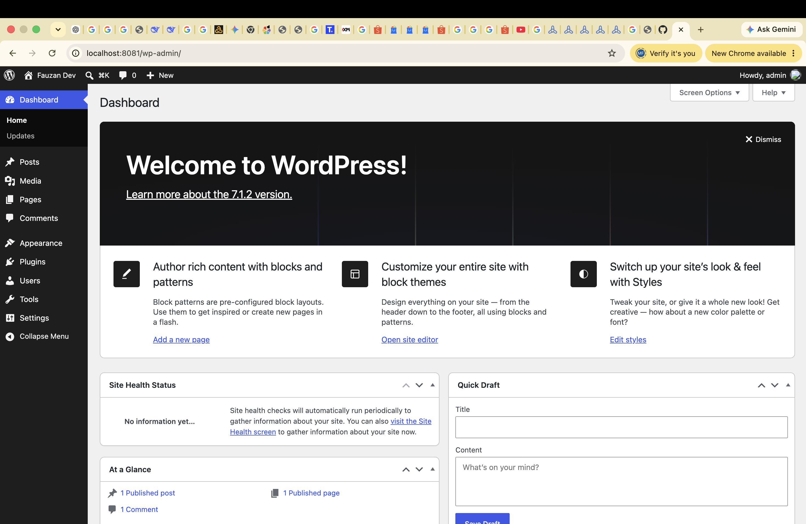

# WordPress Docker Stack - M2 Mac Ready ⚡️

Production-ready WordPress stack running on Docker, optimized for Apple Silicon (M1/M2/M3).

I built this because most tutorials fail on M2 Mac. This one just works.



### Live Proof
Running locally at `http://localhost:8081`

### Tech Stack
- WordPress 6.x
- MySQL 8.0 (M2 Compatible)
- Docker & Docker Compose
- Volumes for persistent data

### How to Run
```bash
git clone https://github.com/muhammadfauzan-jpg/wordpress-docker-stack.git
cd wordpress-docker-stack
docker-compose up -d
